# T_T_Star Workflow Sequence Diagram

This diagram describes the main execution flow of the rhythm game automation script (`main.py`), including the **Swipe-Hold (Strip)** logic for hard mode.

```mermaid
sequenceDiagram
    participant U as User
    participant M as main.py
    participant MOD as module.py
    participant G as Game Window
    participant K as Keyboard Driver

    U->>M: Start Script
    M->>M: Load Templates (incl. L_Strip, R_Strip)
    
    loop Find Window
        M->>MOD: find_window_by_process()
        MOD-->>M: hwnd
    end

    M->>M: Initialize holding_flags, timers,<br/>L_swipe_pressed=False, R_swipe_pressed=False,<br/>L_remembered_slot=None, R_remembered_slot=None

    loop Detection Loop
        M->>MOD: capture_window(hwnd)
        MOD->>G: Grab pixels (mss)
        G-->>MOD: BGRA Frame
        MOD-->>M: BGR Frame

        rect rgb(240, 240, 240)
            Note over M: Phase 1 — Background Difference Check (Tap/Cross-Tap Release)
            loop For each held slot (tap/cross_tap)
                M->>M: crop_region(window_img, BG_AREA)
                M->>M: Compare with recorded_bg
                alt Difference > Threshold
                    M->>MOD: newpress(key, action='up')
                    MOD->>K: Release Key
                    M->>M: holding_flags[key] = False
                end
            end
        end

        rect rgb(255, 240, 230)
            Note over M: Phase 1.5 — Swipe-Strip Sustain Check (NEW)
            alt L_swipe_pressed == True
                M->>M: Crop TRANSFORM_AREA from window_img
                M->>M: Perspective warp → TRANSFORM_SIZE rectangle
                M->>M: Slice rectangle by L_remembered_slot x-range
                M->>MOD: match_template(slot_img, L_Strip)
                alt No Match
                    M->>MOD: newpress(left_swipe_key, action='up')
                    MOD->>K: Release Left Shift
                    M->>M: L_swipe_pressed = False, L_remembered_slot = None
                end
            end
            alt R_swipe_pressed == True
                M->>M: Crop TRANSFORM_AREA from window_img
                M->>M: Perspective warp → TRANSFORM_SIZE rectangle
                M->>M: Slice rectangle by R_remembered_slot x-range
                M->>MOD: match_template(slot_img, R_Strip)
                alt No Match
                    M->>MOD: newpress(right_swipe_key, action='up')
                    MOD->>K: Release Right Shift
                    M->>M: R_swipe_pressed = False, R_remembered_slot = None
                end
            end
        end

        rect rgb(230, 250, 230)
            Note over M: Phase 2 — Note Detection
            M->>M: detect_notes(window_img)
            activate M
            M->>MOD: match_hsv_region (cross_tap)
            M->>MOD: match_template (tap)
            alt L_swipe_pressed == False
                M->>MOD: match_template (left_swipe)
            else L_swipe_pressed == True
                Note right of M: Skip — already held
            end
            alt R_swipe_pressed == False
                M->>MOD: match_template (right_swipe)
            else R_swipe_pressed == True
                Note right of M: Skip — already held
            end
            deactivate M
            M-->>M: detected_notes list
        end

        rect rgb(230, 230, 250)
            Note over M: Phase 3 — Execution Logic
            loop For each note in detected_notes
                alt is Tap / Cross-Tap
                    M->>M: check_strip_color()
                    alt is Long Note (Strip)
                        M->>MOD: newpress(key, action='down')
                        MOD->>K: Press Key
                        M->>M: holding_flag = True, record bg
                    else is Normal Tap
                        M->>MOD: newpress(key, action='tap')
                        MOD->>K: Press & Release Key
                    end
                else is Left Swipe (L_swipe_pressed must be False)
                    rect rgb(255, 245, 220)
                        Note over M: Swipe-Strip Detection (NEW)
                        M->>M: Crop TRANSFORM_PRE_AREA from window_img
                        M->>M: Perspective warp → TRANSFORM_PRE_SIZE rectangle
                        M->>M: Split rectangle into 4 slots by TRANSFORM_PRE_SLOT
                        loop For each slot slice (break on first match)
                            M->>MOD: match_template(slot_img, L_Strip)
                        end
                        alt L_Strip matched in a slot
                            M->>MOD: newpress(left_swipe_key, action='down')
                            MOD->>K: Hold Left Shift
                            M->>M: L_swipe_pressed = True
                            M->>M: L_remembered_slot = matched slot
                        else No match
                            M->>MOD: newpress(left_swipe_key, action='tap')
                            MOD->>K: Press & Release Key
                        end
                    end
                else is Right Swipe (R_swipe_pressed must be False)
                    rect rgb(255, 245, 220)
                        Note over M: Swipe-Strip Detection (NEW)
                        M->>M: Crop TRANSFORM_PRE_AREA from window_img
                        M->>M: Perspective warp → TRANSFORM_PRE_SIZE rectangle
                        M->>M: Split rectangle into 4 slots by TRANSFORM_PRE_SLOT
                        loop For each slot slice (break on first match)
                            M->>MOD: match_template(slot_img, R_Strip)
                        end
                        alt R_Strip matched in a slot
                            M->>MOD: newpress(right_swipe_key, action='down')
                            MOD->>K: Hold Right Shift
                            M->>M: R_swipe_pressed = True
                            M->>M: R_remembered_slot = matched slot
                        else No match
                            M->>MOD: newpress(right_swipe_key, action='tap')
                            MOD->>K: Press & Release Key
                        end
                    end
                end
            end
        end
    end
```

## Phases Summary

| Phase | Purpose |
|---|---|
| **Phase 1 — BG Diff Check** | Release held tap/cross_tap keys when background changes |
| **Phase 1.5 — Swipe-Strip Sustain** | Check the single remembered slot via `TRANSFORM_AREA` → release shift if strip gone |
| **Phase 2 — Note Detection** | Detect notes; **skip** left_swipe/right_swipe matching if already held |
| **Phase 3 — Execution** | Execute actions; for swipe → check `TRANSFORM_PRE_AREA` for strips, break on first match |

### State Variables

| Variable | Type | Description |
|---|---|---|
| `L_swipe_pressed` | `bool` | Whether left shift is currently held |
| `R_swipe_pressed` | `bool` | Whether right shift is currently held |
| `L_remembered_slot` | `str \| None` | Single slot key where L_Strip was matched (e.g. `"slot_2"`) |
| `R_remembered_slot` | `str \| None` | Single slot key where R_Strip was matched (e.g. `"slot_3"`) |
